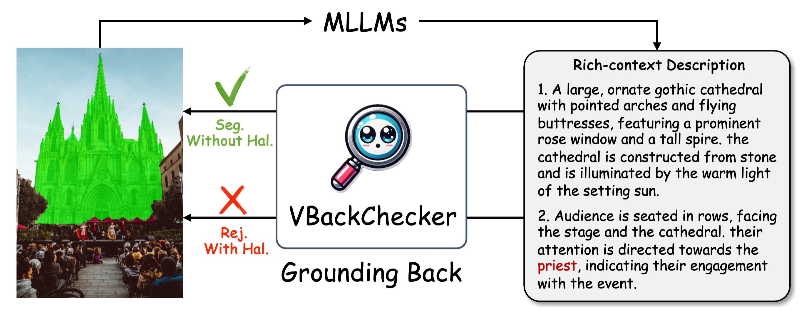
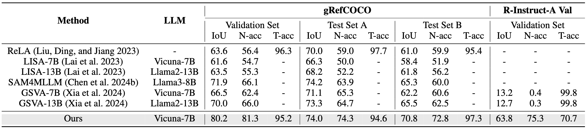
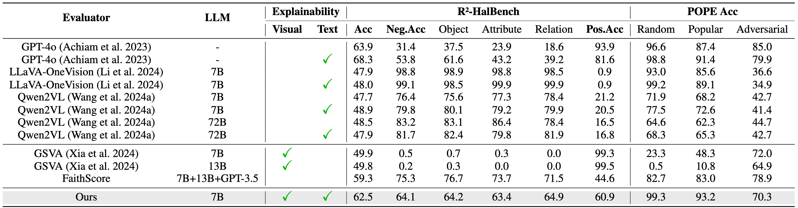

# Seeing is Believing: Rich-Context Hallucination Detection for MLLMs via Backward Visual Grounding

<p align="center"><strong>VBackChecker AAAI'2026</strong></p>

<p align="center">
&nbsp&nbsp📑 <a href="https://arxiv.org/pdf/2511.12140">Paper</a>&nbsp&nbsp | 
&nbsp&nbsp🤖 <a href="...">Model</a>&nbsp&nbsp | 
&nbsp&nbsp🤗 <a href="https://modelscope.cn/datasets/PinxueGuo/R2_HalBench">Benchmark</a>&nbsp&nbsp | 
&nbsp&nbsp🤖 <a href="https://modelscope.cn/datasets/PinxueGuo/R_Instruct">Dataset</a>&nbsp&nbsp
</p>

## Updates
- 2025-11-18: Instruction-tuning data [R_Instruct](https://modelscope.cn/datasets/PinxueGuo/R_Instruct) paired with grounding masks.
- 2025-11-18: New real-response and rich-context benchmark [R2_HalBench](https://modelscope.cn/datasets/PinxueGuo/R2_HalBench) for hallucination detection.

## Introduction
- We propose `R2_HalBench`, a new real-response and rich-context benchmark for hallucination detection, featuring high-quality and rich annotations, and reflecting real-world distributions of hallucination detection tasks.
- Guided by the principle of “Seeing is Believing”, We introduce `VBackChecker`, the first visual-back grounding framework for hallucination detection in MLLMs, which functions efficiently without extra references and experts, processes rich-context responses, and also offers interpretability on both modalities.
- We design a novel pipeline for generating instruction-tuning data, `R_Instruct`, focusing on rich-context object descriptions, paired with grounding masks, and curated challenging negative samples.
- VBackChecker, while providing interpretable ability, not only surpasses existing complex frameworks with state-of-the-art performance on R2_HalBench and POPE, rivaling GPT-4o's hallucination detection capability, but also delivers a **10\% improvement** over previous methods in the challenging pixel-level grounding task.

<div align="center">
  
  <p><em>VBackChecker: Rich-Context Hallucination Detection for MLLMs via Backward Visual Grounding.</em></p>
</div>

<div align="center">
  
  <p><em>Performance of Pixel-level Grouding task on gRefCOCO and R-Instruct-A Val. VBackChecker surpasses prior methods in pixel-level grounding task.</em></p>
</div>

<div align="center">
  
  <p><em>Performance of Hallucination Detection on R2_HalBench and POPE.</em></p>
</div>

## Installation

```bash
conda create -n vbackchecker python=3.10
conda activate vbackchecker
pip install -r requirements.txt
```

## Data Preparation

### 1. Base datasets (from GSVA/LISA)

Follow the [LISA data preparation guide](https://github.com/dvlab-research/LISA/blob/main/README.md#training-data-preparation) and [GSVA](https://github.com/LeapLabTHU/GSVA) to download the original `refer_seg`, `sem_seg`, `reason_seg`, and VQA corpora. Point `DATASET_DIR` to this root (e.g., `/data/lisa_datasets`).

### 2. VBackChecker releases

Unpack the tarballs into `${DATASET_DIR}/refer_seg` after the base LISA data exists.

| Public name | Legacy name | Folder | Usage |
| ----------- | ----------- | ------ | ----- |
| `R2_HalBench` | `grefer_hal` | `refer_seg/R2_HalBench/` | hallucination detection benchmark |
| `R_Instruct_A` | `grefer_syn` | `refer_seg/R_Instruct_A/` | instruction tuning set A |
| `R_Instruct_B` | `grefer_syn2` | `refer_seg/R_Instruct_B/` | instruction tuning set B |

#### Extraction commands

```bash
export DATASET_DIR=/data/lisa_datasets
mkdir -p ${DATASET_DIR}/refer_seg
for pkg in R2_HalBench pope R_Instruct_A R_Instruct_B; do
  tar -xzf ${pkg}.tar.gz -C ${DATASET_DIR}/refer_seg
done
```

Each folder contains two JSONs (`grefs*.json`, `instances*.json`) plus an `images/` directory of SAM-style `sa_*.jpg` files (COCO naming for POPE). The expected tree:

```
${DATASET_DIR}/refer_seg
├── R2_HalBench
│   ├── grefs(unc)_HalMetaBench_checked_1.json
│   ├── instances_HalMetaBench_checkd_1.json
│   └── images/sa_*.jpg
├── R_Instruct_A
│   ├── grefs(unc)_v1.2_extend.json
│   ├── instances_v1.2.json
│   └── images/sa_*.jpg
└── R_Instruct_B
    ├── grefs(unc)_syn2_v4.1.json
    ├── instances_syn2_v4.json
    └── images/sa_*.jpg
```

## Training

You can quickly train a usable model by using pre-trained GSVA weights with [scripts/train_demo.sh](scripts/train_demo.sh).
```bash
export DATASET_DIR=/data/lisa_datasets
export SAM_CKPT=/checkpoints/sam_vit_h_4b8939.pth
export MLLM_CKPT=/checkpoints/LLaVA-Lightning-7B-v1-1
export INIT_WEIGHT=/checkpoints/gsva-7b-ft-gres.bin

ds --master_port=24989 main.py \
  --exp_name="exp_vbackchecker" \
  --segmentation_model_path="${SAM_CKPT}" \
  --mllm_model_path="${MLLM_CKPT}" \
  --vision-tower="openai/clip-vit-large-patch14" \
  --dataset_dir="${DATASET_DIR}" \
  --dataset="refer_seg||vqa" \
  --sample_rates="4,1" \
  --refer_seg_data="R_Instruct_B||R_Instruct_A||grefcoco" \
  --steps_per_epoch 300 \
  --precision="bf16" \
  --lora_r=8 \
  --num_classes_per_sample=5
```

## Evaluation
Evaluate the model with R2_HalBench with [scripts/eval_demo.sh](scripts/eval_demo.sh).

```bash
export DATASET_DIR=/data/lisa_datasets
export SAM_CKPT=/checkpoints/sam_vit_h_4b8939.pth
export MLLM_CKPT=/checkpoints/LLaVA-Lightning-7B-v1-1
export WEIGHT=./outputs/exp_vbackchecker/full_model.bin

CUDA_VISIBLE_DEVICES=0 ds main.py \
  --exp_name="vbackchecker_eval" \
  --val_dataset="R2_HalBench|unc|val" \
  --segmentation_model_path="${SAM_CKPT}" \
  --mllm_model_path="${MLLM_CKPT}" \
  --vision-tower="openai/clip-vit-large-patch14" \
  --dataset_dir="${DATASET_DIR}" \
  --weight="${WEIGHT}" \
  --precision="fp16" \
  --lora_r=8 \
  --eval_only
```

Switch `--val_dataset` to `pope|unc|val` for evaluating with POPE.
